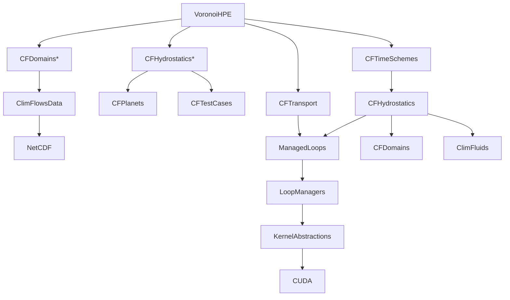
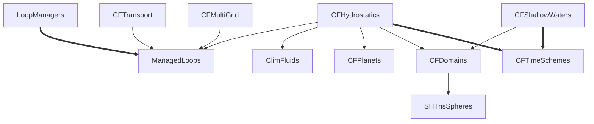

# ClimFlows

ClimFlows is an ongoing effort to develop an *ecosystem* of *composable* and *extensible* packages:
* from which one can compose a variety of climate-relevant numerical models, especially for oceanic and atmospheric circulation, from toy models to realistic solvers
* from which one can cherry-pick specific functionality without having to install the whole ClimFlows ecosystem
* which works on laptops as well as HPC clusters
* whose performance is competitive on CPUs and GPUs, enabling meaningful comparisons
* whose composability builds upon state-of-the-art understanding of the mathematical and physical structure of geophysical models

Building an ecosystem means that thought and effort is put not only in the contents of each package, but also in the way they interact via their respective interfaces (APIs). We expect that arriving at the 'right' APIs will be a trial-and-error process.

See our [Gallery](#gallery) which is sampled from [ClimFlowsExamples](https://github.com/ClimFlows/ClimFlowsExamples).

See all [pull requests](https://github.com/pulls?user=ClimFlows), [issues](https://github.com/issues?user=ClimFlows) and [code coverage](https://app.codecov.io/gh/ClimFlows?repoDisplay=Configured).

 
 
 

## Milestones
Since each independent package deliberately focuses on a limited task, the progress of the ecosystem towards usefulness is demonstrated by achieving milestones where existing packages are composed into a 'useful product'. Achieved milestones are:

* a hydrostatic, global atmospheric solver with arbitrary thermodynamics and competitive performance on CPU and GPU
  
Our next milestones are:

* a *differentiable* dry, hydrostatic, global atmospheric solver. Possibly based on spherical harmonics.
* a dry atmospheric general circulation solver with *arbitrary thermodynamics* and simplistic but *physically-consistent* models (parameterizations) for radiation, turbulence and convection.
* an implicit-LES Boussinesq/anelastic solver in logically-Cartesian domains

## Language

For the time being ClimFlows is mostly Julia-based. Choosing a single computing language makes development easier, but it fractions the already small community of climate-relevant model developers. Ultimately, we would like to find ways to make ClimFlows a polyglot project, with a focus firstly on robust language-agnostic APIs based on sound concepts and abstractions, and secondly on implementations in different languages with different limitations.

We consider implementing the most promising APIs in (modern) Fortran when sensible. Contributors comfortable with other languages, especially C++, PyTorch and JAX, are welcome.

## Package overview
* Physics:
  [ClimFlowsTestCases](https://github.com/ClimFlows/ClimFlowsTestCases.jl),
  [ClimFluids](https://github.com/ClimFlows/ClimFluids.jl),
  [CFPlanets](https://github.com/ClimFlows/CFPlanets.jl),
  [CFShallowWaters](https://github.com/ClimFlows/CFShallowWaters.jl),
  [CFHydrostatics](https://github.com/ClimFlows/CFHydrostatics.jl)
* Maths:
  [CFTimeSchemes](https://github.com/ClimFlows/CFTimeSchemes.jl),
  [SHTnsSpheres](https://github.com/ClimFlows/SHTnsSpheres.jl),
  [CFDomains](https://github.com/ClimFlows/CFDomains.jl),
  [CFTransport](https://github.com/ClimFlows/CFTransport.jl),
  [CFMultiGrid](https://github.com/ClimFlows/CFMultiGrid.jl)
* Performance:
  [ManagedLoops](https://github.com/ClimFlows/ManagedLoops.jl),
  [LoopManagers](https://github.com/ClimFlows/LoopManagers.jl),
  [SIMDMathFunctions](https://github.com/ClimFlows/SIMDMathFunctions.jl)
* Convenience:
  [MutatingOrNot](https://github.com/ClimFlows/MutatingOrNot.jl),
  [MemberFunctions](https://github.com/ClimFlows/MemberFunctions.jl),
  [CookBooks](https://github.com/ClimFlows/CookBooks.jl)
* Other:
  [ClimFlowsPlots](https://github.com/ClimFlows/ClimFlowsPlots.jl),
  [ClimFlowsData](https://github.com/ClimFlows/ClimFlowsData.jl)

ClimFlows Julia packages that are
not sufficiently general-purpose and mature to be registered in the General Julia registry
are registered in [JuliaRegistry](https://github.com/ClimFlows/JuliaRegistry/commits/master/).

### Dependencies

The call graph of a typical main program, here `VoronoiHPE.jl` from ClimFlowsExamples, looks like:

where a star indicates a call made when initializing the model. 

However a deep call graph does not necessarily imply a deep dependency graph among packages. The key to a shallow ecosystem dependency graph is [dependency inversion](https://en.wikipedia.org/wiki/Dependency_inversion_principle), whereby a package implements a function whose interface (API) is defined in another package. In this example, `CFHydrostatics` implements functions whose API is defined in `CFTimeSchemes`. These functions are called by `CFTimeSchemes` during time integration. Similarly `LoopManagers` implements functions whose API is defined in `ManagedLoops`. To do so, it uses `KernelAbstractions` and `CUDA`, a relatively big package from the wider Julia ecosystem. Performance-critical routines from `CFHydrostatics` are passed to `ManagedLoops`, `LoopManagers`, `KernelAbstractions` and ultimately to `CUDA` to be executed on a GPU. Similarly the function `NetCDF.ncread` is passed by the main program to `ClimFlowsData` then `CFDomains`, which does not have to depend on `NetCDF` to read the mesh description from disk.

As a result, the dependency graph of ClimFlows packages so far is essentially:

Independent packages are omitted, as wel as tiny packages such as `MutatingOrNot`. Plain arrows represent a call from one package to another, while bold arrows represent a *reverse dependency*.
These arrows make it possible to buy into only a fraction of ClimFlows. For instance it would be entirely possible to use a package from the Julia ecosystem to perform time integration, instead of using `CFTimeSchemes`. In line with the [open-closed principle](https://en.wikipedia.org/wiki/Open%E2%80%93closed_principle), new packages can extend existing packages by implementing their API, without modifying the original package or deepening the dependency graph.

While Julia is designed for composability, many other languages, including some considered as legacy, support dependency inversion. For instance, in Fortran 2003, dependency inversion can be achieved by means of procedures (with a fully typed interface) passed as arguments and/or abstract types with deferred bindings.

## Gallery

### Hydrostatic compressible equations, spherical harmonics

https://github.com/user-attachments/assets/71d3168e-2d8e-4c71-9cf8-9b0d936a8881

### Rotating shallow-water equations, spherical harmonics

https://github.com/ClimFlows/.github/assets/24214175/4410dfe0-eff4-4b8c-b17b-546103ba6579

### Rotating shallow-water equations, mimetic finite differences

https://github.com/ClimFlows/.github/assets/24214175/3ae1b0a0-bef2-4ef1-8602-7c1f86b381a4

